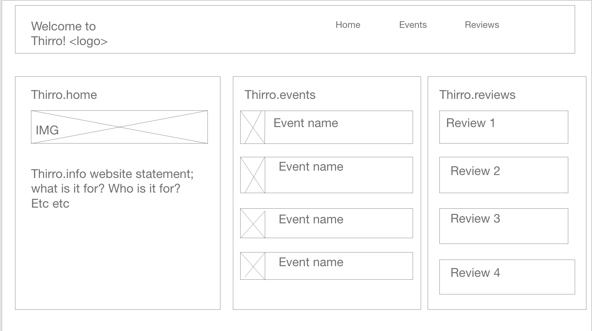
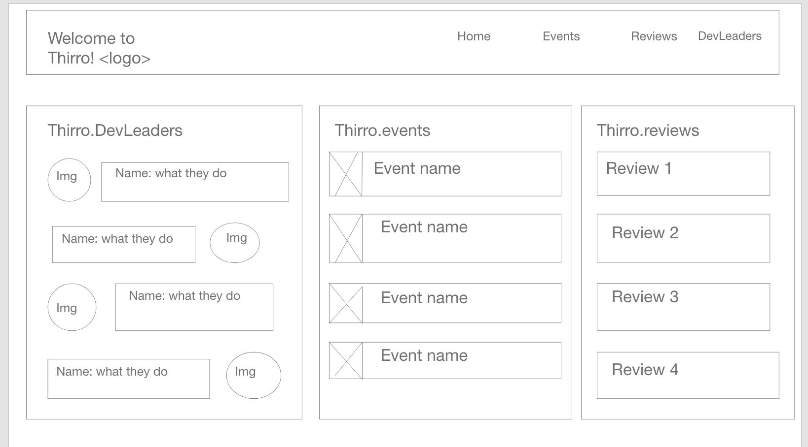

# Thirro.info
Attempt at full stack app for school project; database api info hard coded

Minimum Project Requirements
 Project has Instructor approval at the start of project week- Completed 
 
 Project code is pushed to a public Git repository - Completed 
 
 Project planning board used throughout project- Completed (used Tello: https://trello.com/b/Gz5la6sd/thirroinfo )
 
 Uses Postgres as a SQL database- Completed 
 
 Uses Spring Boot w/Maven as a build tool - Completed
 
 ReactJS is used for frontend development- Completed 
 
 Uses CSS or styled components to style application- Completed
 
 Uses MVC architecture- Completed 
 
 Frontend uses AJAX requests to pass information to the backend- Completed (axios)
 
 Application uses 3 models in backend using Hibernate/JPA- Completed (Events;Reviews;DevSpeakers)
 
 App renders in browser- Completed 
 
 Uses a 3rd party api- 
 
 Project is deployed using 1 of the deployment options(heroku, surge, aws or firebase) - Using heroku
 
 Project code is pushed to a public Git repository- Completed 
 
Must contain a readme file at the root of the repository- This is readme for root :D

 Git repo has at least 30 git commit- Completed 
 
 Frontend uses AJAX requests to pass information to the backend- Completed
 
 App should be able to use CRUD in some form- Completed (Home.js component)
 
 readme file clearly documents the purpose of the project as a problem statement
 ## Problem Statement 
 > Many developers deal with stresses and frustrations whether just starting out in the career or throughout their journey of it.
 
 readme file clearly documents the target end user for this program.
 ## Audience 
 > Devs of all stages. A community webpage where developers and pick forums to start a topic of conversation, chat with other devs via comments, and have an outlet to relax with references to events around them.
 
 readme file has embedded link (not url) to publicly deployed app- 
 
 readme file includes image to wireframes- Completed 

 
 
